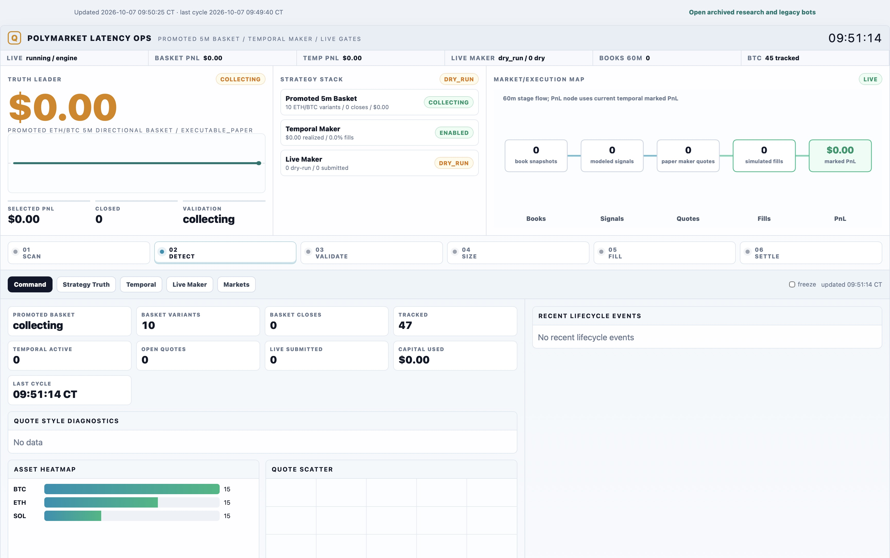
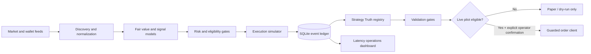

# Polymarket Research Engine

[](https://github.com/jnaggud/polymarket-bot/actions/workflows/ci.yml)
[](https://www.python.org/)
[](LICENSE)

A paper-first prediction-market research system for market discovery, signal evaluation, execution-realistic
simulation, strategy validation, and operational monitoring.

The project is designed around a simple rule: modeled edge is not the same as executable profit. Historical model
results, queue-aware paper fills, observed rebates, and wallet-reconciled results are tracked separately so an
optimistic simulation cannot silently qualify a strategy for live trading.



_Dashboard shown with an isolated showcase ledger; figures are not live-performance claims._

> [!IMPORTANT]
> This repository is research software, not financial advice. Live trading is disabled by default. Eligibility,
> credentials, venue rules, and regulatory requirements remain the operator's responsibility. The engine checks
> Polymarket's geoblock endpoint before order placement and refuses live execution from restricted locations.

## Engineering highlights

- **Execution-realistic paper fills** — VWAP book walking, latency decay, slippage, depth haircuts, fees, and partial
  fills are modeled explicitly.
- **Canonical strategy truth** — model PnL, executable-paper PnL, maker rebates, and wallet results are never merged
  into one misleading headline.
- **Epoch-aware experiments** — a changed execution model starts a new result epoch instead of inheriting historical
  performance from incompatible assumptions.
- **Queue-aware market making** — passive quotes track queue position, inventory skew, fill probability, adverse
  selection, quote TTLs, and forced exits.
- **Promotion gates** — minimum resolved trades, market-day coverage, drawdown, concentration, positive after-cost
  PnL, and a positive lower 95% trade-EV bound are required before a live pilot can qualify.
- **Defense in depth** — dry-run defaults, explicit confirmation values, geoblock checks, reconciliation, heartbeat,
  daily-loss, exposure, cooldown, and stale-data gates protect order paths.
- **Inspectable operations** — a compact dashboard exposes market flow, lifecycle events, active strategies,
  execution assumptions, and validation blockers.

## Architecture



The repository contains two related workflows:

1. **Research pipeline** — discovers markets and public-wallet activity, produces optional structured theses,
   evaluates consensus and microstructure signals, sizes paper positions, and monitors exits.
2. **Latency engine** — tracks short-horizon crypto markets, evaluates directional and complete-set opportunities,
   simulates maker/taker execution, and records every decision in an auditable event ledger.

See [Architecture](docs/architecture.md) for component boundaries and data flow, and the
[engineering case study](docs/portfolio-case-study.md) for the design decisions behind the project.

## Quick start

### Requirements

- Python 3.10 or newer
- macOS, Linux, or Windows
- The [official Polymarket CLI](https://github.com/Polymarket/polymarket-cli) for CLI-backed discovery workflows

### Install

```bash
git clone https://github.com/jnaggud/polymarket-bot.git
cd polymarket-bot
python3 -m venv .venv
source .venv/bin/activate
python -m pip install --upgrade pip
python -m pip install -e ".[dev]"
cp .env.example .env
```

The committed configuration contains placeholders only. Keep `.env`, private keys, API credentials, state databases,
and logs out of version control.

### Run one paper cycle

```bash
python3 main.py cycle
```

### Run the latency engine and cockpit

Terminal 1:

```bash
python3 main.py daemon-latency-bot-engine --interval 10
```

Terminal 2:

```bash
python3 main.py serve-latency-bot-dashboard --host 127.0.0.1 --port 8090
```

Open `http://127.0.0.1:8090/?mode=fast`. The compact dashboard refreshes from
`http://127.0.0.1:8090/api/state`; `?mode=full` retains the deeper research views.

## Core workflows

| Command | Purpose |
| --- | --- |
| `discover-targets` | Rank public wallet activity from a leaderboard or normalized CSV export. |
| `refresh-target-activity` | Refresh and normalize recent activity for the research watchlist. |
| `scan` | Filter active markets by liquidity, spread, category, and resolution horizon. |
| `brain` | Generate an optional structured thesis through the configured OpenAI model. |
| `trade` | Evaluate convergence, wallet activity, and order-book microstructure votes. |
| `monitor-exits` | Apply target, stale-thesis, rotation, and de-risk exit rules. |
| `cycle` | Run the end-to-end paper research loop. |
| `daemon-latency-bot-engine` | Continuously run short-horizon discovery, simulation, and accounting. |
| `serve-latency-bot-dashboard` | Serve the latency operations cockpit and JSON state endpoint. |
| `latency-bot-summarize` | Print recent engine, signal, execution, and PnL diagnostics. |

Run `python3 main.py --help` for the full command list.

## Strategy Truth

The dashboard's **Strategy Truth** view is the canonical strategy comparison surface. Each row declares an execution
tier and selects only the PnL that belongs to that tier:

| Tier | Meaning | Promotion eligible |
| --- | --- | --- |
| `optimistic_simulation` | Historical or non-atomic fills retained for research. | No |
| `shadow` | Signals observed without claiming executable fills. | No |
| `executable_paper` | After-cost paper results using explicit execution assumptions. | Gate-dependent |
| `live_cash` | Reconciled venue/wallet outcomes. | Already live |

The promoted ETH/BTC five-minute directional variants use the `vwap_latency_partial_fill_v1` execution epoch. Older
top-of-book results remain visible in the archive but cannot pass the live gate.

## Safety model

The default configuration is intentionally conservative:

- `BOT_MODE=paper`
- `LIVE_TRADING_ENABLED=false`
- live pilots disabled and set to `dry_run`
- explicit confirmation strings required for live paths
- private-key and API credential fields blank
- live temporal maker requires positive paper PnL, reconciliation, and a passed validation gate
- stale books, insufficient depth, daily losses, excessive exposure, and restricted geography block execution

Do not weaken those defaults in a committed file. If you experiment with live connectivity, use a separate low-value
account, confirm venue eligibility, and independently review every risk limit.

## Configuration

[`.env.example`](.env.example) documents the available settings. The main groups are:

- discovery, liquidity, and resolution-horizon filters
- paper bankroll and portfolio limits
- promoted directional variant definitions
- realistic fill, latency, depth, and fee assumptions
- temporal inventory-maker quoting and risk controls
- complete-set and related-market research
- live-pilot confirmations and credentials
- validation thresholds and dashboard limits

OpenAI is optional. Without `OPENAI_API_KEY`, the system skips predictive thesis generation instead of inventing a
model estimate.

## Verification

Run the same checks used in CI:

```bash
ruff check .
python3 -W error::DeprecationWarning -W error::ResourceWarning -m unittest discover -s tests
python3 main.py --help >/dev/null
```

The current suite contains 146 tests covering accounting, discovery, execution models, position lifecycles, risk
gates, strategy epochs, live-pilot preflight, and dashboard rendering.

## Project layout

```text
bot/                 research pipeline, accounting, configuration, and dashboard
latency_bot/         feeds, signal models, execution models, storage, risk, and cockpit
scripts/             local process and diagnostic helpers
tests/               deterministic unit and integration-style tests
config/              public, non-secret research fixtures
docs/                architecture, research notes, and portfolio case study
main.py              command-line entry point
```

## Limitations

- Paper fills are models, not guarantees of venue execution.
- Latency, queue priority, partial fills, cancellations, and outages can differ materially from configured
  assumptions.
- Historical PnL does not predict future performance.
- Public-wallet activity can be delayed, incomplete, or economically ambiguous.
- Multi-leg opportunities carry legging and settlement risk unless execution is truly atomic.
- The codebase is an active research system and has not been independently audited for production trading.

See the [roadmap](ROADMAP.md) for the remaining validation, execution, and operations work.

## References

- [Polymarket API overview](https://docs.polymarket.com/getting-started/api)
- [Polymarket geographic restrictions](https://docs.polymarket.com/api-reference/geoblock)
- [Polymarket official CLI](https://github.com/Polymarket/polymarket-cli)
- [`poly_data`](https://github.com/warproxxx/poly_data) public market-data tooling

## Contributing and security

Contributions are welcome through focused pull requests. See [CONTRIBUTING.md](CONTRIBUTING.md). Please report
security issues privately as described in [SECURITY.md](SECURITY.md).

## License

Released under the [MIT License](LICENSE).
