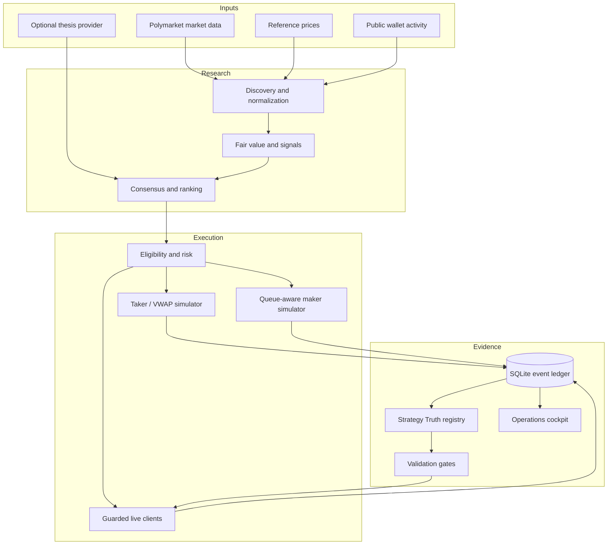

# Architecture

The system separates research claims from execution claims. Data collection, signal generation, order simulation,
accounting, validation, and optional live connectivity are distinct boundaries with their own persisted evidence.

## Component map

## Research pipeline

The `bot` package provides the original market-research loop:

1. Discover candidate markets and public-wallet activity.
2. Normalize books, token identifiers, liquidity, and time-to-resolution.
3. Produce an optional structured thesis or operate without one.
4. Combine convergence, wallet, and microstructure votes.
5. Apply sizing, portfolio, concentration, cooldown, and health rules.
6. Record paper positions and monitor exits.

## Latency engine

The `latency_bot` package is organized by boundary:

- `feeds/` acquires venue books, reference prices, public wallet activity, and cross-venue research inputs.
- `strategy/` calculates fair values, signals, complete-set candidates, and related-market constraints.
- `risk/` centralizes limits and eligibility decisions.
- `execution/` models paper fills and contains separately guarded live clients.
- `storage.py` owns the event ledger, migrations, summaries, and reconciliation data.
- `maintenance.py` provides bounded, archive-first raw-data retention and storage diagnostics.
- `validation.py` compares strategies with baselines and produces walk-forward, cost-sensitivity, queue-calibration,
  and independent-fill gates.
- `demo.py` produces an isolated credential-free ledger for reproducible review.
- `strategy_truth.py` maps every strategy to an evidence tier and validation result.
- `dashboard.py` renders operational state without recomputing or relabeling PnL.

## Execution epochs

An execution-model change creates a new epoch. For example, promoted five-minute directional variants using
`vwap_latency_partial_fill_v1` do not inherit PnL from legacy top-of-book fills. The old rows remain inspectable as
`optimistic_simulation`, while new rows accumulate `executable_paper` evidence from zero.

This prevents a common backtesting failure: improving the realism of a model while retaining profit produced by the
less realistic model.

## Strategy validation

Live-pilot eligibility requires all configured gates to pass:

- eligible execution tier;
- minimum resolved trades;
- minimum distinct market days;
- positive after-cost PnL;
- maximum bankroll-relative drawdown;
- maximum share of positive PnL from one market; and
- positive lower 95% confidence bound on per-trade EV.

Passing the strategy gate is necessary but not sufficient. Live clients also require explicit enablement,
confirmation, geographic eligibility, current reconciliation, healthy heartbeat, fresh books, venue credentials, and
order-level exposure and loss checks.

## Data ownership

Runtime evidence belongs under ignored `state/`, `data/`, and `logs/` directories. The repository contains only
source code, safe configuration examples, public fixtures, documentation, and tests.

The retention boundary deliberately separates reproducible raw observations from durable audit evidence. Old books,
reference ticks, fair values, and signal rows may be archived in bounded batches. Orders, fills, positions, lifecycle
events, PnL, risk events, and reconciliation records are never included in the default retention target set.
